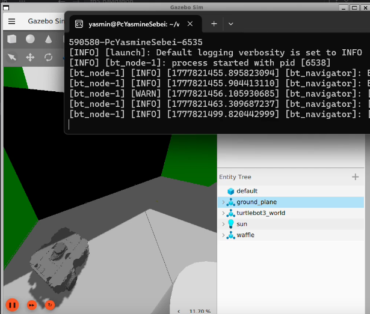
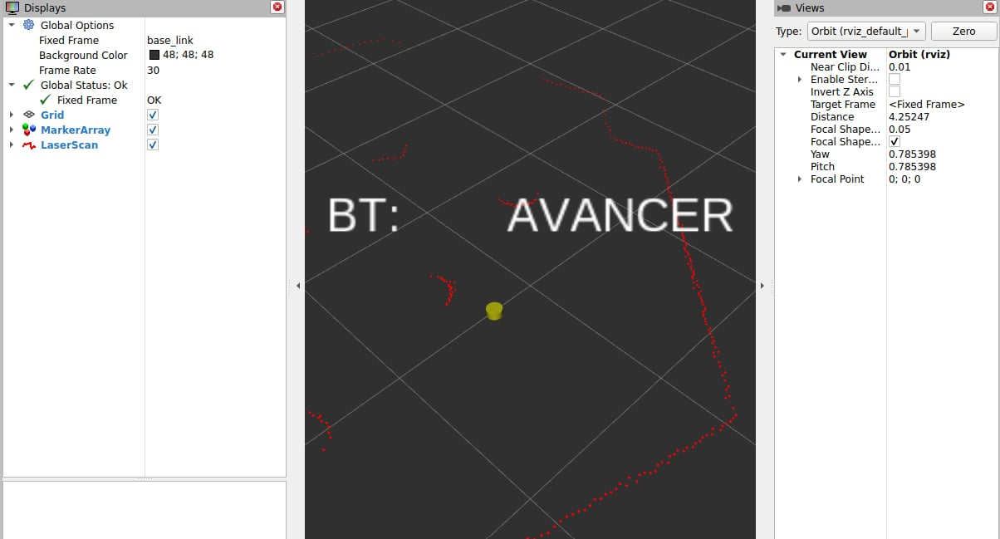
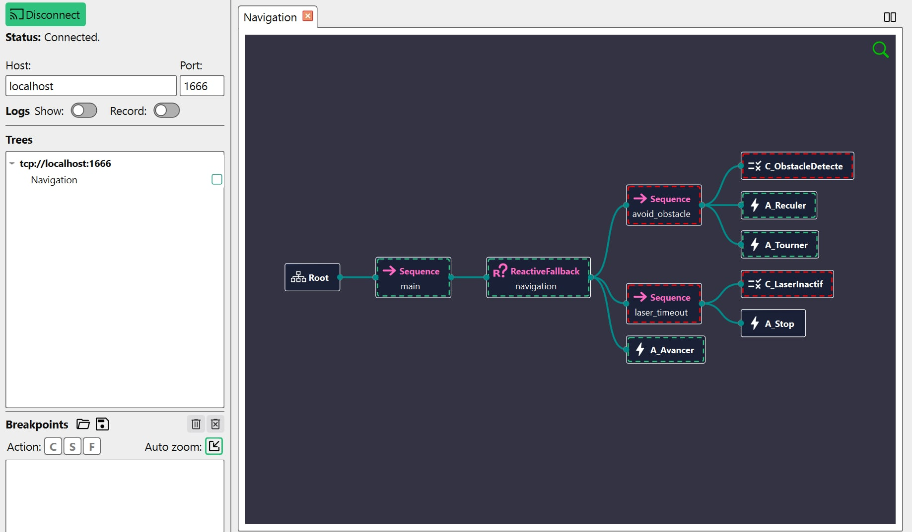

# ObstacleSense Navigator Autonomous Navigation for TurtleBot3

A ROS 2 project implementing autonomous obstacle avoidance and navigation for a TurtleBot3 Waffle using a 2D LiDAR sensor. The package includes two versions of the same behavior:

- a Finite State Machine (FSM) implementation
- a Behavior Tree (BT) implementation with Groot2 visualization support

This project was designed for ROS 2 Jazzy and Gazebo Harmonic, and it targets a real navigation loop based on laser readings, state transitions, and velocity commands.

---

## Overview

The robot continuously reads laser scan data from `/scan`, evaluates the free space in front of it, and reacts according to the detected obstacle conditions.

The implemented logic is a classic bump-and-go / obstacle avoidance pattern:

1. move forward when the path is clear
2. detect obstacles in the front region
3. reverse for a short time
4. turn in the direction with the largest free space
5. resume forward motion when the path is clear again
6. stop if LiDAR data becomes inactive for too long

The system publishes `geometry_msgs/msg/TwistStamped` to `/cmd_vel` and can also publish visualization markers for debugging in RViz.

---

## Project Structure

```text
project_root/
├── src/
│   ├── fsm_node.cpp        # FSM implementation
│   └── bt_node.cpp         # Behavior Tree implementation
├── launch/
│   ├── fsm.launch.py       # Launch file for FSM mode
│   └── bt.launch.py        # Launch file for BT mode
├── trees/
│   └── navigation.xml      # Behavior tree definition
├── CMakeLists.txt
├── package.xml
├── README.md
```

---

## Features

### FSM Version
The `fsm_node` implements a state machine with the following states:

- `FORWARD`: move forward while checking obstacle conditions
- `BACK`: reverse after obstacle detection
- `TURN`: rotate toward the least obstructed side
- `STOP`: halt motion if the LiDAR scan times out

Key logic:

- scan is evaluated in a frontal sector around the robot
- the code checks multiple laser sectors (center + lateral front zones)
- hysteresis is used to avoid toggling too quickly around the obstacle threshold
- a soft speed profile is applied when moving forward
- the robot chooses turn direction using the larger free space on the left or right

### Behavior Tree Version
The `bt_node` runs a behavior tree loaded from `trees/navigation.xml` and exposes a Groot2 publisher on port `1666`.

Main behavior tree structure:

```text
Root
└── Sequence
    └── ReactiveFallback
        ├── Sequence (avoid_obstacle)
        │   ├── C_ObstacleDetecte
        │   ├── A_Reculer
        │   └── A_Tourner
        ├── Sequence (laser_timeout)
        │   ├── C_LaserInactif
        │   └── A_Stop
        └── A_Avancer
```

The tree includes:

- `C_ObstacleDetecte`: obstacle detected when a minimum distance is below the threshold
- `C_LaserInactif`: detects LiDAR inactivity timeout
- `A_Avancer`: publishes forward velocity
- `A_Reculer`: backs up for a fixed duration
- `A_Tourner`: rotates for a fixed duration and checks clear path before ending
- `A_Stop`: stops the robot completely

---

## ROS Topics Used

| Topic | Type | Direction | Purpose |
|---|---|---|---|
| `/scan` | `sensor_msgs/msg/LaserScan` | Input | Laser data used for obstacle detection |
| `/cmd_vel` | `geometry_msgs/msg/TwistStamped` | Output | Velocity commands sent to the robot |
| `/bt_markers` | `visualization_msgs/msg/MarkerArray` | Output | Debug visualization markers for BT state |

> Important: in Gazebo Harmonic, the robot is controlled through `TwistStamped` instead of plain `Twist`. The command message includes a `header` and `twist` field, as implemented in this package.

---

## Parameters and Thresholds

These values are defined in the source code and determine the behavioral response:

| Parameter | Value | Meaning |
|---|---:|---|
| `SPEED_LINEAR` | `0.2` m/s | Forward linear speed |
| `SPEED_ANGULAR` | `0.5` rad/s | Angular turn speed |
| `OBSTACLE_DIST` | `0.5` m | Obstacle detection threshold |
| `BACKING_TIME` | `3` s | Reverse duration |
| `TURNING_TIME` | `3` s | Rotation duration |
| `SCAN_TIMEOUT` | `5` s | LiDAR timeout before stop |

The LiDAR check is performed in a front cone around `0°`, with additional checks at lateral front angles to estimate the best turning direction.

---

## Requirements

### System

- Ubuntu 24.04
- ROS 2 Jazzy
- Gazebo Harmonic
- TurtleBot3 simulation packages

### ROS 2 packages

Install the required dependencies:

```bash
sudo apt update
sudo apt install ros-jazzy-turtlebot3 \
  ros-jazzy-turtlebot3-simulations \
  ros-jazzy-turtlebot3-gazebo \
  ros-jazzy-behaviortree-cpp \
  ros-jazzy-ros-gz-bridge
```

---

## Installation

Place this package in your ROS 2 workspace:

```bash
cd ~/ws_ros/src
# copy or clone the project package here
```

Then build it:

```bash
cd ~/ws_ros
colcon build --packages-select <your_package_name>
source install/setup.bash
```

To make the environment available in every shell session, add these lines to `~/.bashrc`:

```bash
source /opt/ros/jazzy/setup.bash
source ~/ws_ros/install/setup.bash
export TURTLEBOT3_MODEL=waffle
```

Then reload the shell:

```bash
source ~/.bashrc
```

---

## Running the Simulation

### 1. Start Gazebo

Open a terminal and run:

```bash
source /opt/ros/jazzy/setup.bash
source ~/ws_ros/install/setup.bash
export TURTLEBOT3_MODEL=waffle
ros2 launch turtlebot3_gazebo turtlebot3_world.launch.py
```

Wait until the Gazebo world is fully loaded and the robot appears in the scene.

### 2. Check LiDAR data

Open a second terminal:

```bash
source ~/ws_ros/install/setup.bash
ros2 topic hz /scan
```

You should see a healthy scan rate. A typical output is around `~1.3 Hz` for the TurtleBot3 LiDAR stream.

---

## Launch the Navigation Modes

### FSM mode

```bash
source ~/ws_ros/install/setup.bash
ros2 launch <your_package_name> fsm.launch.py
```

This launches the finite-state machine node `fsm_node`.

### Behavior Tree mode

```bash
source ~/ws_ros/install/setup.bash
ros2 launch <your_package_name> bt.launch.py
```

This launches the behavior tree node `bt_node`, which loads the XML tree defined in `trees/navigation.xml` and exposes Groot2 visualization at `localhost:1666`.

---

## Visual Debugging

## Demo Gallery

### Gazebo Simulation



### RViz2 Visualization



### Groot2 Behavior Tree



### RViz2

You can visualize the LiDAR and robot state in RViz:

```bash
source /opt/ros/jazzy/setup.bash
rviz2
```

Then configure RViz to show:

- LaserScan on `/scan`
- Marker topic `/bt_markers` or state markers if enabled
- TF frames for the TurtleBot3 robot

### Groot2

For the behavior tree version, open Groot2 and connect to the publisher port:

```text
localhost:1666
```

You can then inspect live state transitions, node execution, and condition evaluation in real time.

---

## Useful ROS Commands

```bash
# List running topics
ros2 topic list

# Inspect the scan frequency
ros2 topic hz /scan

# Echo the velocity commands
ros2 topic echo /cmd_vel

# List active nodes
ros2 node list

# Publish a manual velocity command for testing
ros2 topic pub /cmd_vel geometry_msgs/msg/TwistStamped \
  "{header: {frame_id: 'base_link'}, twist: {linear: {x: 0.2}}}" --rate 10
```


---
## Troubleshooting

### No scan data on `/scan`

- confirm Gazebo is running
- confirm the TurtleBot3 model was exported correctly
- ensure the simulation plugin is loading correctly
- verify the topic exists with:

```bash
ros2 topic list | grep scan
```

### Robot does not move

- verify `/cmd_vel` is being published
- check node health with:

```bash
ros2 node list
ros2 topic echo /cmd_vel
```


